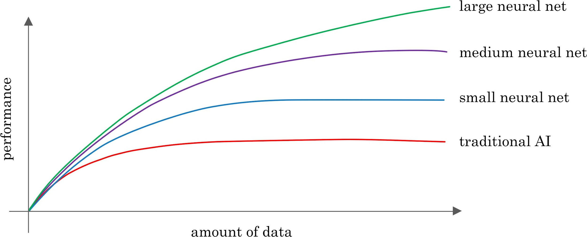

# Week 1 Quiz

## Question 1

Which of these terms best describes the type of AI used in today’s email spam filters, speech recognition, and other specific applications?

- Artificial Narrow Intelligence (ANI)

- Artificial General Intelligence (AGI)

## Question 2

What do you call the commonly used AI technology for learning input (A) to output (B) mappings?

- Unsupervised learning

- Supervised learning

- Artificial General Intelligence

- Reinforcement learning

## Question 3

You want to use supervised learning to build a speech recognition system. The figure above suggests that in order for a neural network (deep learning) to achieve the best performance, you would ideally use: (Select all that apply)

- A large dataset (of audio files and the corresponding text transcript)

- A small dataset (of audio files and the corresponding text transcript)

- A large neural network

- A small neural network

## Question 4

The only way to acquire data for a supervised learning algorithm is to manually label it. I.e., given the input A, to ask a human to provide B.

- True

- False

## Question 5

Which of these statements regarding data acquisition do you agree with?

- Only structured data is valuable; AI cannot process unstructured data.

- Some types of data are more valuable than others; working with an AI team can help you figure out what data to acquire.

- It doesn’t help to give data to an AI team, because they can always produce whatever they need by themselves.

- It doesn’t matter how data is acquired. The more data, the better.

## Question 6

You run a company that manufactures scooters. Which of the following are examples of unstructured data? (Select all that apply.)

- The maximum speed of each of your scooters

- Pictures of your scooters

- The number of scooters sold per week over the past year

- Audio files of the engine sound of your scooters

## Question 7

Suppose you run a website that sells cat food. Which of these might be a good result from a data science project? (Select all that apply.)

- Insights into how to market cat food more effectively, depending on the breed of cat.

- A large dataset of images labeled as “Cat” and “Not Cat”

- A slide deck presenting a plan on how to modify pricing in order to improve sales.

- A neural network that closely mimics how cats’ brains work.

## Question 8

Based on the terminology defined in Lesson 4 “The terminology of AI”, which of the following statements do you agree with? (Select all that apply.)

- The terms “deep learning” and “neural network” are used almost interchangeably.

- The terms “machine learning” and “data science” are used almost interchangeably.

- AI is a type of deep learning. (I.e., All AI algorithms are deep learning algorithms.)

- Deep learning is a type of machine learning. (I.e., all deep learning algorithms are machine learning algorithms.)

## Question 9

Which of these do AI companies do well?

- Strategic data acquisition

- Invest in unified data warehouses

- Spot automation opportunities

- All of the above

## Question 10

Say you want to input a picture of a person’s face (A), and output whether or not they are smiling (B). Because this is a task that most humans can do in less than 1 second, supervised learning can probably learn this A-to-B mapping.

- True

- False
