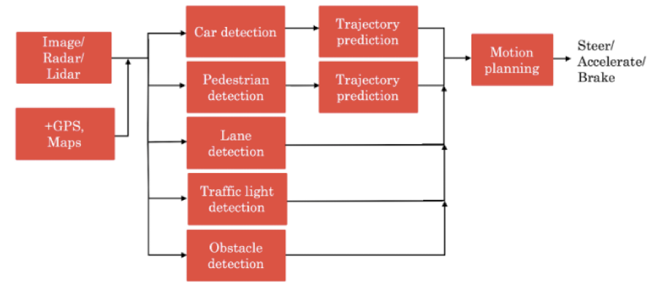
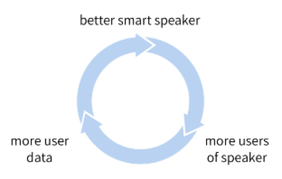
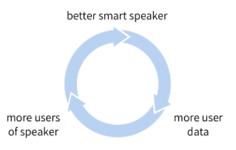
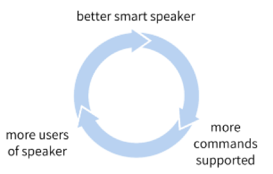
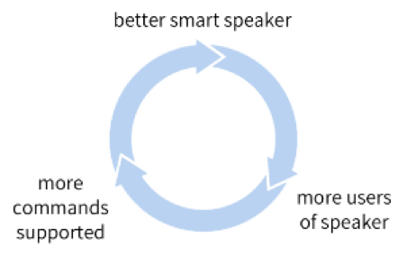

# Question 1

Because a smart speaker can carry out multiple functions (such as tell a joke, play music, etc.) it is an example of Artificial General Intelligence (AGI).

- True

- False

# Question 2

What are the key steps to a smart speaker function?

- Trigger word detection -> speech recognition -> intent recognition -> command execution.

- Speech recognition → Trigger word detection -> intent recognition -> command execution.

- Trigger detection -> intent recognition -> speech recognition -> command execution.

- Trigger word detection -> intent recognition -> speech recognition -> command execution.

# Question 3

Consider this system for building a self-driving car:

The component for pedestrian detection is usually built using:

- Supervised learning

- GANs

- Reinforcement learning

- A motion planning algorithm

# Question 4

Suppose you are building a trigger word detection system, and want to hire someone to build a system to map from Inputs A (audio clip) to Outputs B (whether the trigger word was said), using existing AI technology. Out of the list below, which of the following hires would be most suitable for writing this software?

- Machine learning engineer

- Machine learning researcher

- Data engineer

- AI Product Manager

# Question 5

What is the first step in the AI Transformation Playbook for helping your company become good at AI?

- Provide broad AI training

- Develop an AI strategy

- Execute pilot projects to gain momentum

- Build an in-house AI team

# Question 6

According to the AI Transformation Playbook, what is the most important outcome of your first pilot project?

- Succeed and show traction within 6-12 months

- Drive extremely high value for the business

- Be executed by an in-house team

- None of the above

# Question 7

Say you are building a smart speaker, and want to accumulate data for your product through having many users. Which of these represents the “Virtuous circle of AI” for this product?

(A)

- 

(B)

- 

(C)

- 

(D)

- 

# Question 8

Why is developing an AI strategy NOT the first step in the AI Transformation Playbook?

- Without having some practical AI experience and knowing what it feels like to build an AI project, a company usually does not know enough to formulate a sound strategy.

- When transforming a company into an AI company, one does not need a strategy, therefore it can’t be the first step.

- There is no reason. Developing an AI strategy IS the first step in the AI Transformation Playbook.

- The strategy should be to use the Virtuous Circle of AI, which comes after building a product.

# Question 9

According to the AI Transformation Playbook, broad AI training needs to be provided not only to engineers, but also to executives/senior business leaders and to leaders of divisions working on AI projects.

- True

- False

# Question 10

Which of the following are AI pitfalls to avoid? (Select all that apply)

- Expecting traditional planning processes to apply without changes.

- Pairing engineering talent with business talent to identify feasible and valuable projects.

- Expecting AI based projects to work the first time.

- Expecting AI to solve everything.
